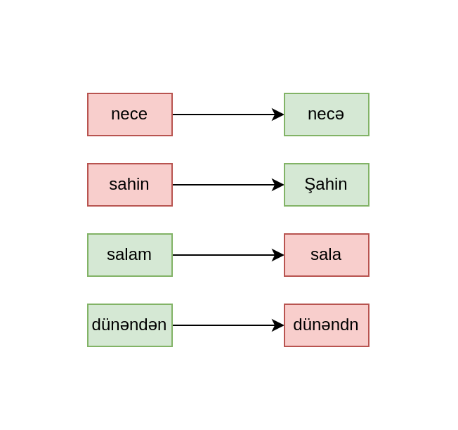

# Spelling correction via Deep Ensembles for Azerbaijani language
Deep learning models are known to be an effective method for spelling correction. We started with an LSTM-based encoder-decoder architecture, as described in this [tutorial](https://keras.io/examples/nlp/lstm_seq2seq/). It worked relatively well for originally incorrect words, but had poor performance in retaining the originally correct words. For example:

  
In order to solve this problem, we tested Deep Ensemble architecture.

## Our Approach
The idea is to train multiple models. These models should have:
* Same architecture
* Trained on same data
* Initialized with **different** seeds
  
During inference, all of these base models make a prediction, and these predictions are passed on to a decision algorithm.

Original Deep Ensemble architecture suggests combining logits, but approach failed in our case. Our decision algorithm is an adjusted form of the **hard voting** system employed in bagging models.

## Results

<table>
<tr><th>Prediction per model </th><th>Prediction with multiple models</th></tr>
<tr><td>

| Model ID | Accuracy | Latency per word |
|----------|----------|----------|
| Model 1 | 73.1% | 0.003 sec |
| Model 2 | 70.7% | 0.003 sec |
| Model 3 | 68.3% | 0.003 sec |
| Model 4 | 73.5% | 0.003 sec |
| Model 5 | 73.5% | 0.003 sec |
| Model 6 | 73.2% | 0.003 sec |
| Model 7 | 73.2% | 0.003 sec |
| Model 8 | 66.1% | 0.003 sec |

</td><td>

| Number of models | Treshold | Accuracy | Latency per word |
|----------|----------|----------|----------|
| 8 | 1 |  |  |
| 8 | 2 | 81.0% | 0.006 sec |
| 8 | 3 | 81.3% | 0.01 sec |
| 8 | 4 | 80.2% | 0.012 sec |
| 8 | 5 | 78.0% | 0.015 sec |
| 8 | 6 |  |  |
| 8 | 7 |  |  |
| 8 | 8 |  |  |

</td></tr> </table>

| Method | Model ID(s) | Threshold | Best Result |
|----------|----------|----------|----------|
| Base model | Model 4 | - | 73.5% |
| Delta | Model 4 | 0.85 | 75.7% |
| Entropy | Model 4 | 0.3 | 75.7% |
| Ensemble | Model 1-8 | 3 | 81.3% |

Our "Ensemble" method improves the performance considerably.
| Base                            | Delta                            | Entropy                            | Ensemble                            |
| ----------------------------------- | ----------------------------------- | ----------------------------------- | ----------------------------------- |
|  |  |
