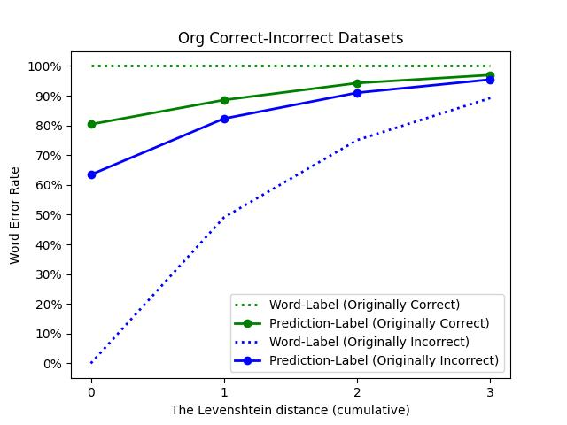
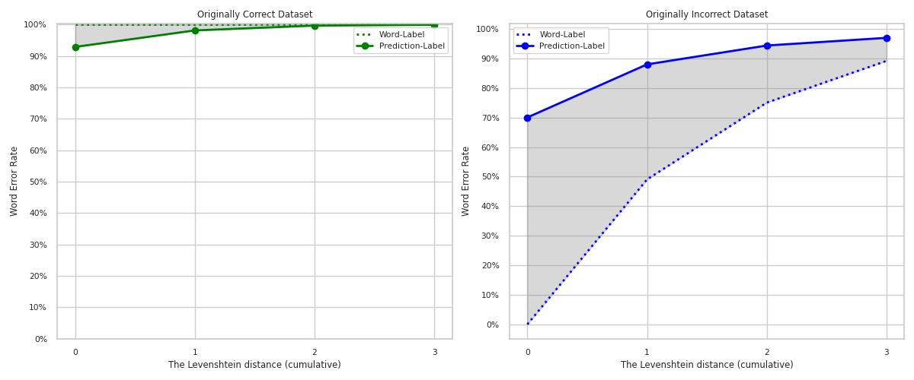

# Spelling correction via Deep Ensembles for Azerbaijani language

Deep learning models are known to be an effective method for spelling correction. We started with an LSTM-based encoder-decoder architecture, as described in this [tutorial](https://keras.io/examples/nlp/lstm_seq2seq/). It worked relatively well for originally incorrect words, but had poor performance in retaining the originally correct words. For example:

  
In order to solve this problem, we tested Deep Ensemble architecture.

The idea is to train multiple models. These models should have:
* Same architecture
* Trained on same data
* Initialized with **different** seeds
  
During inference, all of these base models make a prediction, and these predictions are passed on to a decision algorithm.

Original Deep Ensemble architecture suggests combining logits, but approach failed in our case. Our decision algorithm is an adjusted form of the **hard voting** system employed in bagging models.

This new approach improves the performance considerably.

