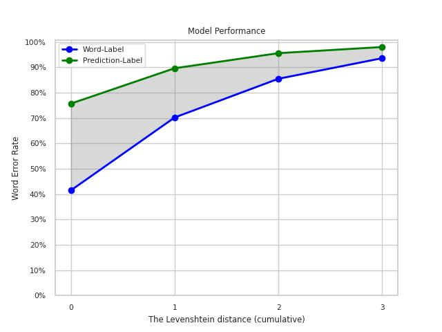
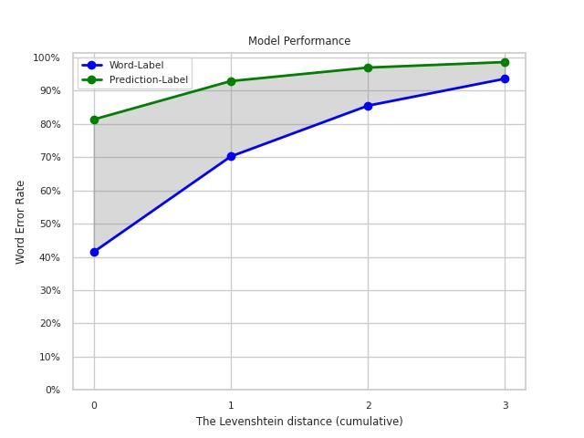

# Spelling correction via Deep Ensembles for Azerbaijani language
Deep learning models are known to be an effective method for spelling correction. We started with an LSTM-based encoder-decoder architecture, as described in this [tutorial](https://keras.io/examples/nlp/lstm_seq2seq/). It worked relatively well for originally incorrect words, but had poor performance in retaining the originally correct words. For example:

  
In order to solve this problem, we tested Deep Ensemble architecture.

## Our Approach
The idea is to train multiple models. These models should have:
* Same architecture
* Trained on same data
* Initialized with **different** seeds
  
During inference, all of these base models make a prediction, and these predictions are passed on to a decision algorithm.

Original Deep Ensemble architecture suggests combining logits, but approach failed in our case. Our decision algorithm is an adjusted form of the **hard voting** system employed in bagging models.

## Results

<table>
<tr><th>Prediction with BASE models</th><th>Prediction with ENSEMBLE model</th></tr>
<tr><td>

| Model ID | WER | CER | Word Latency |
|----------|----------|----------|----------|
| Model 1 | 25.23% | 6.36% | 0.002 sec |
| Model 2 | 25.84% | 6.52% | 0.002 sec |
| Model 3 | 26.93% | 7.23% | 0.002 sec |
| Model 4 | 26.52% | 6.77% | 0.002 sec |
| Model 5 | 26.44% | 6.82% | 0.002 sec |
| Model 6 | 25.01% | 6.03% | 0.002 sec |
| Model 7 | 25.82% | 6.59% | 0.002 sec |
| Model 8 | 27.21% | 6.97% | 0.002 sec |

</td><td>

| N_of_models | Treshold | WER | CER | Word Latency |
|----------|----------|----------|----------|----------|
| 8 | 1 | 26.52% | 6.77% | 0.002 sec |
| 8 | 2 | 17.82% | 3.64% | 0.006 sec |
| 8 | 3 | 16.89% | 3.50% | 0.009 sec |
| 8 | 4 | 17.55% | 3.93% | 0.012 sec |
| 8 | 5 | 19.57% | 4.67% | 0.014 sec |
| 8 | 6 | 22.68% | 5.66% | 0.016 sec |
| 8 | 7 | 27.38% | 6.98% | 0.016 sec |
| 8 | 8 | 36.61% | 9.43% | 0.014 sec |

</td></tr> </table>

### Best Performing Models

| Method | Model ID(s) | Threshold | Best WER |
|----------|----------|----------|----------|
| Base model | Model 6 | - | 25.01% |
| Delta | Model 1 | 0.85 | 23.44% |
| Entropy | Model 1 | 0.225 | 23.31% |
| Ensemble | Model 1-8 | 3 | 16.89% |

| Method | Model ID(s) | Threshold | Best CER |
|----------|----------|----------|----------|
| Base model | Model 6 | - | 6.03% |
| Delta | Model 6 | 0.85 | 5.15% |
| Entropy | Model 6 | 0.25 | 5.08% |
| Ensemble | Model 1-8 | 3 | 3.50% |

As you can see, our "Ensemble" method improves the performance considerably.

| Base                            | Delta                            |
| ----------------------------------- | ----------------------------------- |
|  |  |  |  |
| **Entropy**                            | **Ensemble**                            |
|  |  |
